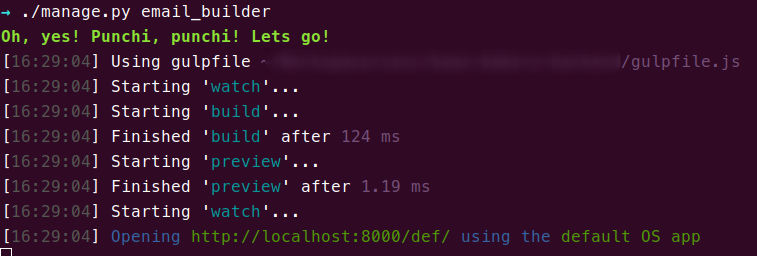

========
Commands
========

Three important commands are included with this application.

email_builder
-------------

This command launches a *gulp* process and watches your source files so that they are re-compiled, using panini + inky.

How to execute it::

    ./manage.py email_builder

If you run this command before your project has been configured, you will see a message similar to this one::

    → ./manage.py email_builder
    Oops! Something went wrong...
      - Some of the required modules are not installed in "node_modules". Please run "./manage.py install_requires"
      - It is necessary to define DEF_TEMPLATES_SOURCE_PATH in your settings
      - The templates directory must have a valid structure. It must contain the pages, layouts, partials and helpers folders. You can run ".manage.py create_basic_structure" to build this structure, and to add a basic layout.
      - It is necessary to define DEF_TEMPLATES_TARGET_PATH in your settings

This is due to the command performing some checks before it runs. For example, it verifies that you already have the required node
packages, that the required constants have been defined in your settings, etc.

If everything is OK, you'll see something like:

install_requires
----------------

This command uses *npm* or *yarn* (depending on your configuration) to install the required node packages, such as *gulp*, *panini* or *inky*.
It also creates the *gulpfile.js* file in your root path to allow you to use the *email_builder* command.

How to execute it::

    ./manage.py install_requires

.. note:: This command will create the *node_modules* folder, and it will also add some files to your root path: *gulpfile.js*, *yarn.lock*, *package.lock* and *package.json*. Remember to add these entries to your *.gitignore* to avoid committing these files.

create_basic_structure
----------------------

This command creates a basic tree structure in your templates source path. This structure will look like this::

    templates_sources
    ├── assets
    │   └── scss
    │       ├── app.scss
    │       ├── _settings.scss
    │       └── template
    │           └── _template.scss
    ├── helpers
    ├── layouts
    │   └── default.html
    ├── pages
    ├── data
    │   └── context.py
    └── partials

Once you have built this structure, you can start creating your custom templates inside the *pages* folder. Take a look at the official documentation_. We recommend that you use the inky_ template language as it will make your life much easier ;).

.. _documentation: https://foundation.zurb.com/emails/docs/
.. _inky: https://foundation.zurb.com/emails/docs/inky.html

