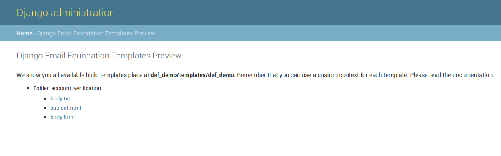

=======================
Preview build templates
=======================

If everythink it's ok and the *email_builder* command runs right, the following view it's opened:

.. note:: For the previous screenshot, we have the following source and target templates.

Sources::

    foundation_templates
    ├── assets
    │   └── scss
    │       ├── app.scss
    │       ├── _settings.scss
    │       └── template
    │           └── _template.scss
    ├── helpers
    ├── layouts
    │   └── default.html
    ├── pages
    │   └── account_verification
    │       ├── body.html
    │       ├── body.txt
    │       └── subject.html
    └── partials

Target::

    templates
    └── emails
        └── account_verification
            ├── body.html
            ├── body.txt
            └── subject.html

The preview view contain a list of all build templates. You can make a click over each one and to see the template
with your custom context.
